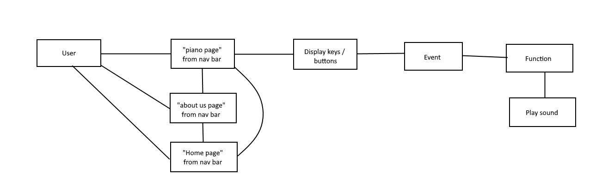

# User stories

1. As a user, I want to play piano notes, electronically.
1. As a piano student, I want a guide for what notes to play for each chord.
1. As a performer, I need a reference to the tone or intonation of a note.
1. As a perspective employer, I want to learn more about the designers of this website.
1. As an up and coming artist, I want a platform to create music on.

## Features

1. As a user, I want to play piano notes, electronically.
  - There will be a form with letter keys to output sound for the selected input
  - Description above form to describe application useage
1. As a piano student, I want a guide for what notes to play for each chord.
  - There will be a form with chord buttons to output sound for the selected input
  - Description above form to describe application useage
  - The piano keys light up when you select a chord
1. As a performer, I need a reference to the tone or intonation of a note.
  - The form will output a sound when a button is clicked
1. As a perspective employer, I want to learn more about the designers of this website.
  - The "about us" page will include information for each person involved in this creation
1. As an up and coming artist, I want a platform to create music on.
  - There will be a section to show a past combination of notes pressed by the user

## Acceptance Tests

  - Ensure when the user inputs a chord or note, there is an output of sound
  - Ensure the about us page loads properly
  - Check local storage for stored notes

# Software requirements

The vision of this product is to display a piano interface capable of user interaction. People who don't have access to a physical piano will still be able to play using our product online. This will allow musicians to potentially create new songs or test out new ideas.

## Scope / in

Our product will:
- Display a form that the user can play a specifically stated note or chord
- Display an about us page to introduce the creators

## Scope / out

Our product won't:
- It won't display sheet music
- It won't play back the displayed stored string of notes from local storage
- Inadequate learning guide, just a tool

Our MVP:
- Press a key to play a note on a form

Stretch goals:
- Have a 'record' button that will store note data in local storage and allow playback of notes a user plays
- Create a digital piano that will play individual notes when clicked
- Have pre-loaded songs in local storage that play on a button click
- Have a switch that changes the sound of the piano from traditional to 'synth' or some other piano style
- Spinning image of images on the about us page, each person has their own theme song

# Functional Requirements

- Press a key to play a note on a form

User arrives at "home" page -> User selected on "piano" page -> User interacts with piano form -> User arrives at "about us" page

